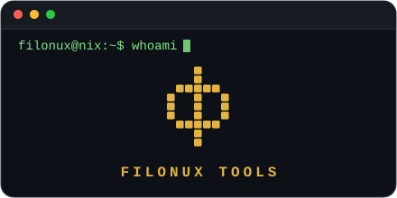

<p align="right"><sub><strong>ES</strong> · <a href="./README.en.md">EN</a></sub></p>



**Filósofo de la tecnología** · investigo cómo las herramientas nos transforman, y construyo algunas por el camino.

> Bienvenido a la caja de herramientas de un filósofo.

---

## `$ cat sobre-mi.md`

Siempre me ha interesado la tecnología, los medios de comunicación y la privacidad. Gran parte de mi carrera ha estado dedicada a investigar los avances tecnológicos que la humanidad ha ido incorporando en sus sociedades, y cómo estos la han ido transformando, para bien y para mal.

Con el paso de los años y los sucesivos cambios, he aprendido a usar la tecnología desde ángulos que no estaban previstos, es decir, usar ese artefacto tecnológico de una nueva forma que sirva como solución ante una dificultad, problema o automatización. Porque las piezas para la solución estaban ahí, pero faltaba montar el puzzle completo para que la solución se hiciese realidad. Esta idea es una de mis líneas de pensamiento: se pueden construir soluciones increíbles con pocos recursos si se sabe utilizarlos correctamente. Al mismo tiempo, trato de mantener las cosas simples pero que a la vez aporten una solución compleja que reduzca fricción, mejore usabilidad y permita al usuario elegir lo que quiera, sin que esa elección le perjudique. Estas ideas han repercutido en cómo están diseñadas las herramientas que os comparto. Lo hago de este modo porque es exactamente lo que hubiese necesitado cuando era un niño, ya que recuerdo lo que era abrir un programa en un idioma extraño, con una jerga técnica, plagado de opciones y menús, sentirme abrumado por no saber qué hacer pese a saber que se pueden hacer innumerables cosas. Ese tipo de impedimentos son los que trato de solventar cuando diseño una solución; el proceso para llegar a ella es lo que más me motiva, pues disfruto aprendiendo, explorando todo lo que desconozco y me encanta mejorar lo que ya sé. Eso es justo lo que me guía en la vida.

La programación, la IA y la automatización son otro modo que he encontrado para trasladar mis ideas a la realidad, al mismo tiempo, me ha dado una actividad placentera en la que puedo pasar muchas horas concentrado.

---

## `$ ls herramientas/`

<!--
  📌 CÓMO AÑADIR UNA HERRAMIENTA NUEVA
  1. Busca la categoría donde mejor encaje. Si ninguna encaja, crea una
     nueva sección con este mismo formato: "### emoji Nombre de categoría" + tabla.
  2. Añade una fila a la tabla de esa categoría, en orden cronológico
     (de más antigua a más reciente) según la fecha de creación del repo:
     | [**Nombre-Del-Repo**](https://github.com/filonux/Nombre-Del-Repo) | Qué hace, en una frase. |
  3. Commit y push — no hace falta tocar nada más de este README.
-->

### 🩺 Mantenimiento del sistema

| Herramienta | Qué hace |
|---|---|
| [**Autostart_Manager**](https://github.com/filonux/Autostart_Manager) | Junta en un mismo panel las apps, servicios systemd y tareas cron que arrancan solas al iniciar sesión, con más control del que ofrece Mint de serie. |
| [**Mint-Doctor**](https://github.com/filonux/Mint-Doctor) | Revisa Linux Mint en busca de los problemas más habituales y los repara automáticamente, bajo tu aprobación en cada paso. |

### 🎨 Personalización y Oficina

| Herramienta | Qué hace |
|---|---|
| [**Color-Mint**](https://github.com/filonux/Color-Mint) | Personaliza la estética completa de Cinnamon —temas, panel, escritorio, terminal y fuentes— desde una sola ventana, con copia de seguridad automática antes de cada cambio. |
| [**PhoneCam**](https://github.com/filonux/PhoneCam) | Convierte la cámara y el micrófono de tu Android en webcam y micrófono de Linux por USB — 100% local, privado y gratis: sin apps en el móvil, sin Wi-Fi, sin nube ni versión de pago. |


### 💾 Copias de seguridad y configuración

| Herramienta | Qué hace |
|---|---|
| [**Mint-Setup**](https://github.com/filonux/Mint-Setup) | Guarda cómo tienes configurado tu escritorio y tus apps —paneles, temas, Wi-Fi, Firefox, VS Code, Docker, header LUKS...— y lo restaura entero en una instalación nueva. |
| [**Simple-Backup**](https://github.com/filonux/Simple-Backup) | Copias de seguridad, resincronización de carpetas y tareas automatizadas, todo en un script de Bash. |

### 🔒 Seguridad y privacidad

| Herramienta | Qué hace |
|---|---|
| [**Enkripta**](https://github.com/filonux/Enkripta) | Cifra carpetas y archivos con AES-256 integrado en Nemo y el escritorio —doble clic, botón derecho, icono propio— como si fuera parte del propio sistema. |
| [**Browser-Cleaner**](https://github.com/filonux/Browser-Cleaner) | Limpia 14 navegadores distintos de la forma más simple, práctica y rápida posible. |

### 🗂️ Gestión de software y archivos

| Herramienta | Qué hace |
|---|---|
| [**MintApp_Remover**](https://github.com/filonux/MintApp_Remover) | Desinstala cualquier programa de Linux Mint de forma segura: cubre todo el software preinstalado y limpia las dependencias huérfanas que deja atrás. |
| [**Renombrador**](https://github.com/filonux/Renombrador) | Renombra archivos y carpetas por lotes, con vista previa y opción de deshacer, desde la terminal o el botón derecho en Nemo. |

### 🧑‍💻 Desarrollo y scripting

| Herramienta | Qué hace |
|---|---|
| [**LinuxMint-Scripter**](https://github.com/filonux/LinuxMint-Scripter) | Web de un solo archivo para generar y auditar scripts de Bash o Python con ayuda de IA — tu proveedor local o en la nube, con tu propia clave, sin servidor intermedio. |
| [**Scriptya**](https://github.com/filonux/Scriptya) | Convierte cualquier script en una app con icono propio e integración en el menú de Cinnamon o el escritorio — instálalo, actualízalo o desinstálalo desde un único sitio. |
| [**Mi-Lanzador**](https://github.com/filonux/Mi-Lanzador) | Secuencias de pasos que abren programas, documentos, páginas web o comandos, colocan ventanas, simulan clics y pulsan teclas, encadenados y en orden — como una macro de AutoHotkey. |
---

## `$ cat stack.txt`


---

## `$ ./stats.sh`

<p align="center">
  
  
</p>

---

## `$ ./contacto.sh`

Abierto a propuestas laborales y colaborativas.

📧 **[filonux@proton.me](mailto:filonux@proton.me)**

```
filonux@nix:~$ _
```
